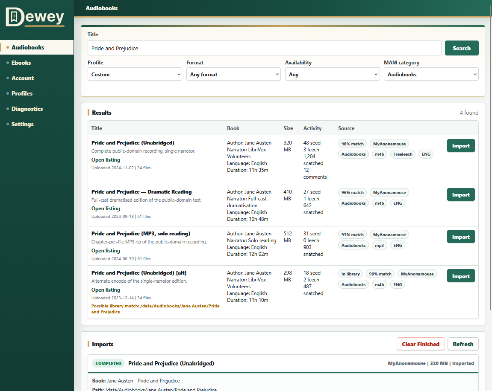
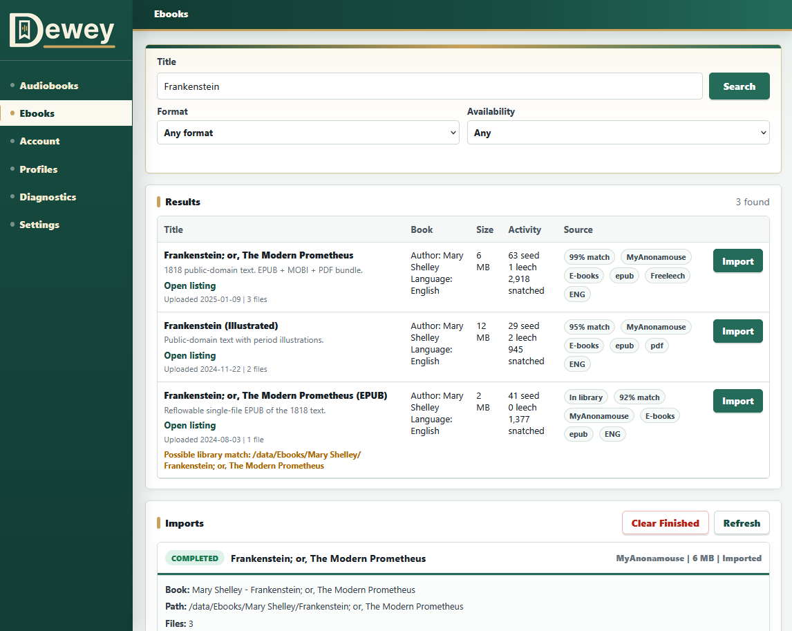

# Dewey

**A self-hosted web app for finding audiobooks and ebooks on MyAnonamouse and filing them away neatly — one click per book, nothing automated.**

You search from a clean web page; when you pick a result, Dewey downloads the torrent, hands it to qBittorrent, waits for it to finish, and files the result into a tidy folder — an Audiobookshelf-style `Author/Book/` layout for audiobooks, or a plain Ebooks folder for a local tool like Calibre to pick up.

Dewey is deliberately manual and single-purpose. It is **not** an unattended grabber, a ratio manager, or an automatic purchaser — you choose every book, every time.

## Screenshots

> The images below are static mocks rendered from [`docs/demo.html`](docs/demo.html) and [`docs/demo-ebooks.html`](docs/demo-ebooks.html). Every title shown is a public-domain work and all numbers are invented — no real tracker data is displayed.

| Audiobooks | Ebooks |
| --- | --- |
|  |  |

## Contents

- [How Dewey works](#how-dewey-works)
- [Before you start](#before-you-start)
- [Responsible use](#responsible-use)
- [Quick start](#quick-start)
- [First-time setup](#first-time-setup)
- [Path mapping (the #1 gotcha)](#path-mapping)
- [Ebooks](#ebooks)
- [Troubleshooting](#troubleshooting)
- [Configuration reference](#configuration-reference)
- [Security](#security)

## How Dewey works

Every import is the same four steps, and none of them happen without you:

1. **Search** — you type a title; Dewey asks MyAnonamouse and lists the matching releases.
2. **Download** — you click **Import**; Dewey grabs the `.torrent` and adds it to qBittorrent.
3. **Wait** — Dewey watches qBittorrent until the download is complete.
4. **File it** — Dewey moves the finished files into the right place (your audiobook library, or your Ebooks folder).

```text
you ──search──▶ Dewey ──sends torrent──▶ qBittorrent ──downloads──▶ Dewey files it ──▶ your library
```

Dewey never decides what to grab or buy on its own. It's a convenience layer over steps you'd otherwise do by hand.

### What it does, in detail

- Searches MyAnonamouse directly using documented endpoints.
- Shows result details such as author, narrator, series, language, size, file type, tags, and listing links.
- Flags results that look like duplicates of something already in your library.
- Downloads the selected `.torrent` through Dewey and sends it to qBittorrent, then watches until it finishes.
- Audiobooks: imports into an `Author/Book Title/` layout, trying hardlinks first (so the torrent can keep seeding) and falling back to a copy when needed. Weak metadata is flagged for a quick manual review.
- Ebooks: copies files into a separate Ebooks folder for a tool like Calibre to organize. See [Ebooks](#ebooks).
- Optional: ask Audiobookshelf to rescan after an import, and/or require a login to open Dewey.

## Before you start

Dewey is a helper, not a full media stack — it plugs into tools you already run. If the terms below are unfamiliar, Dewey probably isn't the best first self-hosting project. You'll want:

- **Docker and Docker Compose** — Dewey runs as a container; this is how you start and update it.
- **qBittorrent**, reachable from Dewey — the BitTorrent client that actually downloads the files. Dewey just tells it what to fetch.
- **A MyAnonamouse account** and its **`mam_id`** — MyAnonamouse ("MAM") is the private audiobook/ebook tracker Dewey searches. `mam_id` is a session cookie from your logged-in browser; **treat it like a password.**
- **A folder for your audiobooks** that Dewey can write to (and an Ebooks folder, if you'll use that tab).
- *Optional:* **Audiobookshelf** — a self-hosted audiobook server, if you want Dewey to trigger a rescan after importing.
- *Optional:* **Calibre** (or anything that watches a folder) — to organize ebooks after Dewey drops them in. Dewey doesn't talk to Calibre; it just writes files where you point it.

The single most common setup problem is **path mapping** — making Dewey and qBittorrent agree on where files live inside their containers. It has [its own section below](#path-mapping); please read it.

## Responsible Use

Dewey is not affiliated with MyAnonamouse. It is intended for personal, manual library importing by users who already have appropriate tracker access.

Use Dewey only in ways allowed by the trackers, services, and communities you connect it to. Dewey should not be used to bypass tracker rules, automate actions that a tracker disallows, scrape undocumented surfaces, share credentials, or perform unattended purchases. If a tracker policy changes, follow the tracker policy first.

VIP-only results can offer a confirmed 4-week VIP purchase before import, but Dewey does not auto-buy VIP, wedges, upload credit, or any other MyAnonamouse bonus store item.

## Quick Start

You need Docker and Docker Compose installed, plus the services listed in [Before you start](#before-you-start).

1. **Make a folder for Dewey** and download two files from this repository into it: `docker-compose.example.yml` and `.env.example`.
2. **Rename `.env.example` to `.env`.** This holds Dewey's settings and secrets. You can leave most of it blank for now and fill things in from the web UI later.
3. **Point the volumes at real folders.** Open `docker-compose.example.yml` and make sure the left side of each line under `volumes:` points at folders that exist on your machine — one for Dewey's config, and one for your media/downloads (where your audiobooks, ebooks, and torrents actually live).
4. **Start Dewey:**
   ```bash
   docker compose -f docker-compose.example.yml up -d
   ```
5. **Open it in a browser:** `http://localhost:8686` (or your server's address, port 8686).

Images are published to GitHub Container Registry:

```text
ghcr.io/djmehs17/dewey:latest     # newest build
ghcr.io/djmehs17/dewey:v0.1.0     # a specific, pinned release
```

Pinning to a version tag like `:v0.1.0` is recommended for a stable setup, so an image update never surprises you.

## First-Time Setup

After Dewey starts, open Settings and fill in the core services.

1. Add your MyAnonamouse `mam_id`.
   Treat this like a password. Dewey hides saved secret values in the UI.

2. Add qBittorrent connection details.
   Set the URL, username, password, category, and save path. A dedicated category such as `dewey` is recommended.

3. Set your library paths.
   `Audiobooks path` is where finished imports should land. `Torrents path` is the root Dewey uses to find completed qBittorrent downloads and create staging folders.

4. Save settings.

5. Open Diagnostics.
   Run checks before your first import. Diagnostics will report whether Dewey can reach qBittorrent and MyAnonamouse, open the database, and write to the configured paths.

6. Search for an audiobook.
   Pick a result, review the metadata, and click Import.

## Path Mapping

Path mapping matters more than almost anything else.

Dewey imports from files that qBittorrent downloaded. That means Dewey must be able to see qBittorrent's completed download path using the same container-side paths.

Recommended shape:

```text
/data
  /audiobooks
  /ebooks
  /torrents
    /dewey
```

Then configure:

```text
DEWEY_AUDIOBOOKS_DIR=/data/audiobooks
DEWEY_EBOOKS_DIR=/data/ebooks
DEWEY_TORRENTS_DIR=/data/torrents
DEWEY_QBITTORRENT_CATEGORY=dewey
DEWEY_QBITTORRENT_SAVE_PATH=/data/torrents/dewey
```

For hardlinks to work, the torrent download path and audiobook library path must be on the same filesystem inside the container. If they are not, Dewey will copy files instead. Ebooks are always copied, so the Ebooks folder can live on a different filesystem (for example a NAS share) without any extra setup.

## qBittorrent Setup

Dewey can create the configured qBittorrent category when `Create category when missing` is enabled.

The recommended category is:

```text
dewey
```

The recommended save path is:

```text
/data/torrents/dewey
```

Using a dedicated category keeps Dewey imports separate from other qBittorrent activity and makes cleanup easier.

## MyAnonamouse Setup

Dewey uses the `mam_id` session value to call documented MyAnonamouse JSON endpoints.

The relevant settings are:

- `mam_id`: required for search, torrent download, account refresh, and VIP purchase actions.
- `Default MAM category`: Audiobooks by default.
- `Default availability`: Any, active, freeleech, VIP-only, or non-VIP.
- `Refresh MyAnonamouse account status automatically`: refreshes VIP/account status on startup and then on the configured interval.

Dewey can detect VIP-only results and block imports unless your VIP status is active. If you choose to buy VIP from Dewey, the action requires explicit confirmation.

## Ebooks

Dewey has a separate **Ebooks** tab for finding and copying ebooks, kept apart from the audiobook workflow. It reuses the same MyAnonamouse search and qBittorrent download machinery, but the import step is different:

- Searches default to the E-books MyAnonamouse category and ebook formats (EPUB, MOBI, AZW3, PDF, CBZ, CBR, and similar).
- Finished downloads are **copied** into the configured Ebooks folder. Unlike audiobooks, ebooks are never hardlinked, so the file in your Ebooks folder is fully independent of the torrent.
- No OpenLibrary lookup and no manual-review step run for ebooks. The idea is that a local library manager such as Calibre reads the real metadata from inside each file and reorganizes it on import, so Dewey just gives it a clean landing spot.

The landing layout is configurable with `Folder layout`:

- `subfolder` (default): each release lands in `Ebooks/Author/Title/` (or `Ebooks/Title/` when the author cannot be parsed). This is collision-proof, keeps multi-format releases together, and works whether you point Calibre's *Auto-add from folder* at it or import manually with *Add books from directories, one book per directory*.
- `flat`: ebook files are copied straight into the Ebooks folder with no per-release subfolder. Best only when the Ebooks folder is a strict Calibre auto-add inbox.

Dewey does not integrate with Calibre directly and does not need Calibre to be running. It only writes files into the Ebooks folder; anything that watches or imports from that folder is up to you.

## Optional Audiobookshelf Scan

Dewey does file-level imports without needing Audiobookshelf.

Audiobookshelf integration is optional. If enabled, Dewey asks Audiobookshelf to scan the configured library after an import. You need:

- Audiobookshelf URL.
- Audiobookshelf API key.
- Audiobookshelf library ID.

Leave scan integration disabled if Audiobookshelf already picks up filesystem changes reliably in your setup.

## Optional App Login

Dewey includes optional app-level authentication for deployments that are not already protected by a trusted reverse proxy, VPN, Cloudflare Access, or similar access layer.

The simplest setup is:

1. Start Dewey on a private network.
2. Open Settings.
3. Set a Dewey login username and password.
4. Enable `Require Dewey login`.
5. Save settings.

Dewey stores a password hash, not the plaintext password. If Dewey is served over HTTPS, enable `Secure cookie only` so browsers send the session cookie only over HTTPS. Leave that option off for plain `http://localhost` testing.

## Troubleshooting

Open the **Diagnostics** page first — it checks qBittorrent, MyAnonamouse, and folder permissions, and usually points straight at the problem.

- **Search returns nothing.** Your `mam_id` is probably missing, expired, or not permitted to use the JSON endpoints — re-copy it from MyAnonamouse. Some accounts also need MyAnonamouse's dynamic seedbox IP option enabled (see `DEWEY_MAM_UPDATE_SEEDBOX_IP` in Advanced Tuning).
- **"This torrent appears to require VIP."** The release is VIP-only and Dewey doesn't see active VIP on your account. Refresh your status on the **Account** page, or reconsider whether you want that release.
- **An import is stuck on "downloading" and never finishes.** This is almost always **path mapping**. Dewey and qBittorrent must see the same files at the same paths inside their containers — recheck [Path mapping](#path-mapping) and make sure the qBittorrent category and save path match Dewey's settings.
- **"No audio files were found" / "No ebook files were found."** Dewey found the torrent but not the file types it expected underneath it — usually another path-mapping mismatch, or a release that contains only formats Dewey doesn't recognize.
- **Audiobook files were copied instead of hardlinked.** The torrent download folder and the audiobook library are on different filesystems inside the container. Copying still works — it just uses more disk and doesn't help seeding. Put both on the same volume if you want hardlinks. (Ebooks are always copied by design.)
- **An import landed in `_unsorted`.** Dewey wasn't confident about the author/title, so it staged the book for review. Open that import, type the correct author and title, and apply — Dewey moves it into place.
- **Can't reach Dewey in a browser.** Confirm the container is up (`docker compose ps`), that port 8686 is published, and that you're using the right address. Dewey also answers a small health check at `/healthz` that returns `{"status":"ok"}` when it's running.

## Configuration Reference

Configuration is loaded from environment variables first, then `/config/settings.json` if you save changes in the UI.

Most settings can be changed from Dewey's Settings page after the first start. The environment file is mainly useful for initial defaults and Docker deployments.

### Core Paths

| Variable | Default | What it does |
| --- | --- | --- |
| `DEWEY_CONFIG_DIR` | `/config` | Stores Dewey's SQLite database, saved UI settings, and logs. Mount this to persistent storage. |
| `DEWEY_AUDIOBOOKS_DIR` | `/data/audiobooks` | Destination library folder where Dewey publishes finished imports. This should be the folder Audiobookshelf watches, if you use Audiobookshelf. |
| `DEWEY_TORRENTS_DIR` | `/data/torrents` | Torrent root Dewey uses to find completed qBittorrent downloads and create `.dewey-staging`. This must line up with qBittorrent's save paths inside the container. |
| `DEWEY_UNSORTED_FOLDER` | `_unsorted` | Folder under `DEWEY_AUDIOBOOKS_DIR` for imports that need manual metadata review. |
| `DEWEY_EBOOKS_DIR` | `/data/ebooks` | Destination folder where the Ebooks tab copies finished ebook imports. |

### Ebooks

| Variable | Default | What it does |
| --- | --- | --- |
| `DEWEY_EBOOK_FOLDER_LAYOUT` | `subfolder` | `subfolder` lands each release in `Ebooks/Author/Title/`; `flat` copies files straight into `DEWEY_EBOOKS_DIR`. |
| `DEWEY_EBOOK_SEARCH_CATEGORY` | `14` | MyAnonamouse main category the Ebooks tab searches. `14` is E-books. |
| `DEWEY_EBOOK_DEFAULT_FORMAT` | blank | Optional default format filter for the Ebooks tab, such as `epub`. Blank means any format. |
| `DEWEY_EBOOK_DEFAULT_LANGUAGE` | blank | Optional default language filter for the Ebooks tab, such as `ENG`. Blank means any language. |

### MyAnonamouse

| Variable | Default | What it does |
| --- | --- | --- |
| `DEWEY_MAM_URL` | `https://www.myanonamouse.net` | Base MyAnonamouse URL. Most users should leave this alone. |
| `DEWEY_MAM_ID` | blank | Your MAM session cookie value. Required for search, torrent downloads, account refresh, and VIP purchase actions. Treat it like a password. |
| `DEWEY_MAM_AUDIOBOOK_CATEGORY` | `13` | Default main category for searches. `13` is Audiobooks. |
| `DEWEY_MAM_SEARCH_LIMIT` | `100` | Maximum number of search results Dewey asks MAM for before local filtering. |
| `DEWEY_MAM_DEFAULT_FORMAT` | blank | Optional default format filter, such as `m4b` or `mp3`. Blank means any format. |
| `DEWEY_MAM_DEFAULT_LANGUAGE` | blank | Optional default language filter, such as `ENG`. Blank means any language. |
| `DEWEY_MAM_DEFAULT_SEARCH_TYPE` | `all` | Default availability filter. Common values include `all`, `active`, `fl`, `VIP`, and `nVIP`. |
| `DEWEY_MAM_BLOCK_VIP_WHEN_INACTIVE` | `true` | Blocks VIP-only imports unless Dewey believes your VIP status is active. |
| `DEWEY_MAM_ACCOUNT_AUTO_REFRESH_ENABLED` | `true` | Refreshes MAM account status automatically on startup and on the configured interval. |
| `DEWEY_MAM_ACCOUNT_REFRESH_INTERVAL_HOURS` | `8` | How often Dewey refreshes MAM account status in the background. |
| `DEWEY_MAM_VIP_STORE_URL` | MAM store URL | Link Dewey opens when you want to view the MAM bonus store manually. |

### qBittorrent

| Variable | Default | What it does |
| --- | --- | --- |
| `DEWEY_QBITTORRENT_URL` | `http://qbittorrent:8080` | qBittorrent Web UI/API URL from Dewey's point of view. In Docker Compose, this is often the service name plus port. |
| `DEWEY_QBITTORRENT_USERNAME` | blank | qBittorrent Web UI username, if auth is enabled. |
| `DEWEY_QBITTORRENT_PASSWORD` | blank | qBittorrent Web UI password, if auth is enabled. Treat it like a secret. |
| `DEWEY_QBITTORRENT_CATEGORY` | `dewey` | Category Dewey assigns to added torrents. A dedicated category keeps Dewey downloads separate. |
| `DEWEY_QBITTORRENT_SAVE_PATH` | `/data/torrents/dewey` | Optional save path for Dewey torrents. This should live under `DEWEY_TORRENTS_DIR` and be visible to both Dewey and qBittorrent. |
| `DEWEY_ENSURE_QBITTORRENT_CATEGORY` | `true` | Creates the qBittorrent category if it does not exist. |
| `DEWEY_MONITOR_INTERVAL_SECONDS` | `30` | How often Dewey checks qBittorrent for download progress. |

### Optional Audiobookshelf Scan

| Variable | Default | What it does |
| --- | --- | --- |
| `DEWEY_AUDIOBOOKSHELF_SCAN_ENABLED` | `false` | Enables scan requests after imports. Dewey can still import files with this disabled. |
| `DEWEY_AUDIOBOOKSHELF_URL` | `http://audiobookshelf:80` | Audiobookshelf URL from Dewey's point of view. |
| `DEWEY_AUDIOBOOKSHELF_API_KEY` | blank | Audiobookshelf API key. Required only if scan requests are enabled. |
| `DEWEY_AUDIOBOOKSHELF_LIBRARY_ID` | blank | Audiobookshelf library ID to scan. Required only if scan requests are enabled. |
| `DEWEY_AUDIOBOOKSHELF_FORCE_SCAN` | `false` | Requests a fuller scan when supported. Leave off unless you know you need it. |

### Optional Dewey Login

| Variable | Default | What it does |
| --- | --- | --- |
| `DEWEY_AUTH_ENABLED` | `false` | Requires users to log in to Dewey. Leave off if Dewey is already protected by a trusted reverse proxy or VPN. |
| `DEWEY_AUTH_USERNAME` | `admin` | Username for Dewey's built-in login. |
| `DEWEY_AUTH_PASSWORD_HASH` | blank | Stored password hash. Prefer setting the password from the UI so Dewey creates this safely. |
| `DEWEY_AUTH_SESSION_SECRET` | blank | Signing secret for login sessions. Dewey can generate one when auth is configured through the UI. |
| `DEWEY_AUTH_COOKIE_NAME` | `dewey_session` | Browser cookie name for Dewey sessions. Most users should leave this alone. |
| `DEWEY_AUTH_COOKIE_SECURE` | `false` | Sends the login cookie only over HTTPS. Turn on for HTTPS deployments; leave off for plain local HTTP testing. |
| `DEWEY_AUTH_SESSION_TTL_HOURS` | `168` | How long a Dewey login session lasts before re-authentication. |

### Advanced Tuning

| Variable | Default | What it does |
| --- | --- | --- |
| `DEWEY_MAM_MIN_RELEVANCE` | `45` | Minimum local match score for search results. Higher values hide more weak matches. |
| `DEWEY_MAM_MIN_SEEDERS` | `0` | Minimum seed count for search results. |
| `DEWEY_MAM_SORT_TYPE` | `default` | MAM sort type. Leave as `default` unless you know the documented sort value you want. |
| `DEWEY_MAM_UPDATE_SEEDBOX_IP` | `false` | Calls MAM's dynamic seedbox IP endpoint before searching. Most users should leave this off. |
| `DEWEY_SEARCH_PROFILES` | built-in defaults | JSON list of search profiles to seed the UI with. Easier to manage from the Profiles page. |
| `DEWEY_AUTHOR_MATCH_THRESHOLD` | `85` | Match score needed to reuse an existing author folder. |
| `DEWEY_METADATA_CONFIDENCE_THRESHOLD` | `74` | Minimum external metadata score before Dewey trusts the match. |
| `DEWEY_FALLBACK_CONFIDENCE_THRESHOLD` | `65` | Minimum parsed metadata confidence before Dewey publishes directly instead of sending to review. |
| `DEWEY_INCLUDE_SERIES_IN_BOOK_FOLDER` | `false` | Includes series text in the book folder name when Dewey can identify it. |
| `DEWEY_OPENLIBRARY_URL` | `https://openlibrary.org` | Metadata lookup base URL. Most users should leave this alone. |
| `DEWEY_OPENLIBRARY_USER_AGENT` | Dewey default | User-Agent sent to OpenLibrary. |
| `DEWEY_METADATA_PROVIDER` | `openlibrary` | Metadata provider name. Currently only OpenLibrary is supported. |
| `DEWEY_LOG_LEVEL` | `INFO` | Logging verbosity. |

MyAnonamouse audiobook search defaults to main category `13`.
The UI shows the documented main categories by name: Audiobooks, E-books, Musicology, and Radio.

Do not commit `.env`, `/config`, SQLite databases, logs, `mam_id`, qBittorrent credentials, or Audiobookshelf API keys.

## Import Behavior

1. Search calls MyAnonamouse `tor/js/loadSearchJSONbasic.php` using the configured `mam_id` cookie.
2. Import downloads the selected `.torrent` through Dewey and uploads the torrent bytes to qBittorrent with the configured category.
3. Dewey polls qBittorrent until the torrent is complete.
4. Audio files are copied or hardlinked into `/data/torrents/.dewey-staging` first.
5. OpenLibrary is queried for canonical title and author when enabled.
6. If metadata is weak, Dewey parses torrent names such as `Author - Series 01 - Book Title`.
7. If author/title confidence is still low, files are published under `_unsorted` and the job is marked for review.
8. Author folders are matched with `rapidfuzz`; high-confidence matches reuse existing folders.
9. Staged files are atomically published into `Author/Book Title/`.
10. Audiobookshelf scanning is skipped unless the optional scan integration is enabled and configured.

## Project Status

Dewey is shared as a **reference implementation** under the MIT license. It works and is used in production, but it is **not actively maintained** — think of it as a solid starting point, not a supported product. Issues and pull requests are welcome but may go unanswered, and **forking is encouraged**: if a fork becomes the living, maintained version, that is a good outcome. See [CONTRIBUTING.md](CONTRIBUTING.md).

Ideas for future work (not commitments) are in [ROADMAP.md](ROADMAP.md).

## Releases

Dewey images are published to GitHub Container Registry at `ghcr.io/djmehs17/dewey`. `latest` tracks the newest build; version tags such as `v0.1.0` are pinned, reproducible releases. Pinning to a version tag is recommended for a stable setup. See the repository's Releases page for what changed in each version.

## Security

Dewey is a download/import control surface. Keep it LAN-only unless it is protected by real authentication such as Dewey's built-in login, Cloudflare Access, or another trusted reverse-proxy auth layer. See [SECURITY.md](SECURITY.md) for reporting and deployment guidance.
